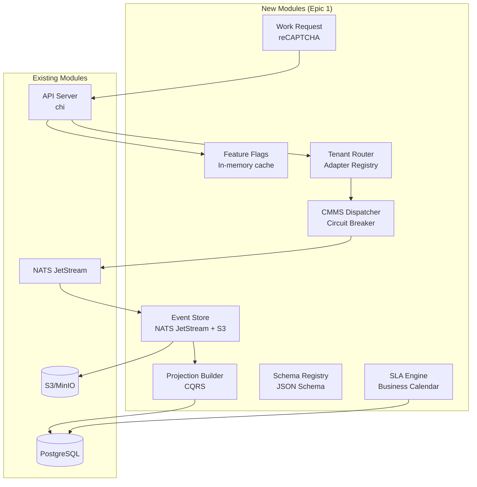

# Code Review: CCTV Monitoring — Epic 1 Changes

**Дата:** 2026-06-24  
**Ревьюер:** Zoo (Architect)  
**Объём:** ~30 modified + ~70 untracked файлов  
**Ветка:** main (нестабильные изменения)

---

## 🔴 CRITICAL (Fix Before Commit)

### C1. СТБ 34.101.30 Crypto Compliance — Placeholder-риски

| Файл | Проблема | Риск |
|------|----------|------|
| [`internal/crypto/aes.go`](../backend/internal/crypto/aes.go) | Использует `crypto/aes` (AES-256-GCM) вместо `belt-gcm` из `bp2012/crypto` | Запрещено для production в РБ |
| [`internal/crypto/stb_stubs.go`](../backend/internal/crypto/stb_stubs.go) | `HashAPIKey()` — SHA-256 вместо `bash`; JWT подпись — HMAC-SHA256 вместо `bign-curve256v1` | Те же |
| [`internal/events/store.go`](../backend/internal/events/store.go:235) | `prev_hash` chain — просто `record.ID`, не СТБ bash-256 HMAC | Audit trail не защищён от tampering |
| [`internal/events/store.go`](../backend/internal/events/store.go:362) | `newUUID()` — time-based, не crypto random | Коллизии в distributed системе |

**Рекомендация:** 
- `go get github.com/bp2012/crypto` 
- Заменить `aes.go` на belt-gcm
- Заменить `HashAPIKey` на bash
- Заменить `prev_hash` на bash-256 HMAC
- Оставить заглушки с TODO до выхода в production, но для commit — хотя бы явный `// TODO: СТБ 34.101.30`

### C2. Panic в production path

| Файл | Проблема |
|------|----------|
| [`internal/crypto/aes.go`](../backend/internal/crypto/aes.go:23) | `getEncryptionKey()` вызывает `panic()` при отсутствии `PUSH_TOKEN_ENCRYPTION_KEY` |
| [`internal/featureflag/manager.go`](../backend/internal/featureflag/manager.go:74) | `NewManager()` вызывает `panic()` при nil db/logger |

**Риск:** Crash при старте в production.  
**Рекомендация:** Заменить `panic` на возврат ошибки (Go-idiomatic).

### C3. Module path mismatch

[`main.go:8-10`](../backend/main.go:8) — импортирует `gb-telemetry-collector/internal/...`, но реальный module path может отличаться.  
**Риск:** `go build` сломается в CI/CD.  
**Рекомендация:** Проверить `go.mod` и синхронизировать.

### C4. CORS default — `["*"]`

[`config.go:162`](../backend/internal/config/config.go:162) — `cors_allowed_origins` по умолчанию `["*"]`.  
**Риск:** OWASP ASVS L3 V9.1 — запрещено.  
**Рекомендация:** Убрать wildcard default, требовать явной конфигурации.

### C5. Fallback в GenerateResetToken()

[`internal/auth/password.go:116`](../backend/internal/auth/password.go:116) — при ошибке `rand.Read()` возвращает `"fallback-token-" + hex.EncodeToString([]byte("emergency"))`.  
**Риск:** Предсказуемый reset token.  
**Рекомендация:** Возвращать ошибку, не fallback.

### C6. Password policy — min 8 символов

[`internal/auth/password.go:33`](../backend/internal/auth/password.go:33) — `len(password) < 8`.  
OWASP ASVS L3 V2 требует **min 12 символов**.  
**Рекомендация:** `if len(password) < 12 { return PasswordWeak, ErrPasswordTooShort }`

---

## 🟡 WARNINGS (Fix Before Production)

### W1. SLA Engine memory leak

[`internal/sla/engine.go:198`](../backend/internal/sla/engine.go:198) — `trackers map[string]*SLATrackerState` никогда не удаляет completed WO.  
**Риск:** Утечка памяти при длительной работе.  
**Рекомендация:** Добавить TTL-эвикшн completed/cancelled трекеров через `time.AfterFunc`.

### W2. Bubble sort в Replay() merge

[`internal/events/store.go:337-341`](../backend/internal/events/store.go:337)— ручная сортировка пузырьком O(n²).  
**Рекомендация:** Заменить на `sort.Slice(all, func(i, j int) bool { return all[i].Timestamp.Before(all[j].Timestamp) })`.

### W3. BaseProjection.Snapshot() — неверные данные

[`internal/events/projection.go:328`](../backend/internal/events/projection.go:328) — `json.Marshal(bp)` сериализует сам `BaseProjection`, а не состояние конкретной проекции.  
**Рекомендация:** Сделать `Snapshot()` абстрактным методом в интерфейсе.

### W4. TraceID без crypto/rand

[`internal/events/store.go:424`](../backend/internal/events/store.go:424) — `newTraceID()` использует timestamp вместо crypto/rand. W3C Trace Context требует 16 байт случайности.  
**Рекомендация:** Использовать `crypto/rand.Read()`.

### W5. Tenant context key — untyped string

[`internal/cmms/tenant_router.go:528`](../backend/internal/cmms/tenant_router.go:528) — `const TenantIDKey contextKey = "tenant_id"` — хорошо, но проверьте, что middleware в `apikey_middleware.go` использует **тот же ключ**.

### W6. SNMP community string default

[`config.go:192`](../backend/internal/config/config.go:192) — `snmp.community: "public"` — небезопасно.  
**Рекомендация:** Убрать default или требовать явной установки.

### W7. FTP credentials default

[`config.go:175-176`](../backend/internal/config/config.go:175) — `ftp.user: "alarm"`, `ftp.password: "alarm_pass"`.  
**Рекомендация:** Требовать явную конфигурацию.

---

## 🟢 POSITIVE (Хорошие паттерны)

| Паттерн | Файл | Комментарий |
|---------|------|-------------|
| Circuit Breaker | [`internal/cmms/dispatcher.go`](../backend/internal/cmms/dispatcher.go) | Чистая реализация с atomic + состояниями closed/open/half-open |
| CQRS + Event Sourcing | [`internal/events/store.go`](../backend/internal/events/store.go) + [`projection.go`](../backend/internal/events/projection.go) | Правильная архитектура: immutable event log → materialized views |
| Feature Flags | [`internal/featureflag/manager.go`](../backend/internal/featureflag/manager.go) | Thread-safe кэш с периодическим refresh, fail-secure |
| Tenant Router | [`internal/cmms/tenant_router.go`](../backend/internal/cmms/tenant_router.go) | Чистый Adapter Registry + per-tenant routing |
| SLA Engine | [`internal/sla/engine.go`](../backend/internal/sla/engine.go) | Правильные интерфейсы (BreachedWorkOrderFinder, EscalationRuleResolver) без циклических зависимостей |
| Business Calendar | [`internal/sla/engine.go:401`](../backend/internal/sla/engine.go:401) | `calculateDeadline()` с учётом рабочих часов |
| OpenAPI spec | [`internal/api/openapi.go`](../backend/internal/api/openapi.go) | API-First подход |
| FeatureFlagMiddleware | [`internal/api/featureflag_middleware.go`](../backend/internal/api/featureflag_middleware.go) | 503 Service Unavailable + Retry-After — fail-secure |
| Cold Storage lifecycle | [`internal/events/cold_storage.go`](../backend/internal/events/cold_storage.go) | S3 lifecycle policy для авто-удаления по retention |

---

## 🏗️ Architectural Observations

### Архитектурная диаграмма изменений

### Пропущенные проверки (не вошли в ревью из-за объёма)

Следующие файлы рекомендую проверить отдельно перед коммитом:

1. **Frontend:** `AssetOverview.tsx`, `ManagerDashboard.tsx`, `TotalCostDashboard.tsx`, `ImportWizard.tsx`, `LiveSLATimer.tsx`, `WorkOrderPrintView.tsx`
2. **Миграции:** `migrations/008-024` — проверить типы полей, индексы, внешние ключи
3. **Тесты:** `dispatcher_test.go`, `tenant_router_test.go`, `store_test.go`, `projection_test.go`, `cold_storage_test.go`, `state_machine_test.go`, `compliance_test.go`
4. **Workforce:** `internal/workforce/entity.go`, `rbac.go`
5. **Meter:** `internal/meter/trigger.go`, `entity.go`
6. **Workflow:** `internal/workflow/engine.go`

---

## ✅ Чеклист перед коммитом

- [ ] **C1-C6:** Исправить critical issues
- [ ] **W1-W7:** Исправить warnings
- [ ] **Build:** `go build ./...` проходит
- [ ] **Tests:** `go test ./...` проходит
- [ ] **Lint:** `golangci-lint run` без ошибок
- [ ] **Vet:** `go vet ./...` без ошибок
- [ ] **SBOM:** Обновить после добавления новых зависимостей
- [ ] **Check migrations order:** 023_feature_flags.up.sql → миграция для feature flags существует
- [ ] **RBAC:** Новые API эндпоинты защищены middleware
- [ ] **Documentation:** ADR-013 актуален
